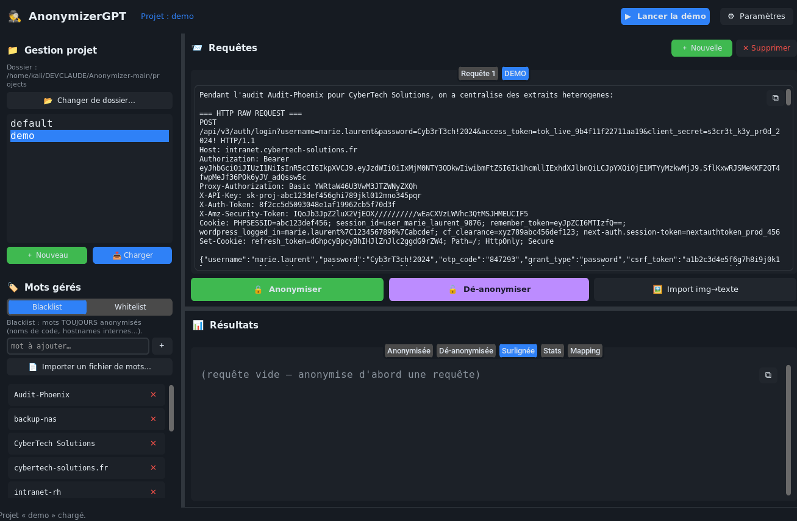

# AnonymizerGPT — Pentest AI Anonymizer


Anonymise les données sensibles (IPs, identifiants, mots de passe, tokens, clés API/IA, domaines, PII…) **avant** de les envoyer à une IA, puis **dé-anonymise** la réponse grâce à une table de concordance propre à chaque projet.


---

## Pourquoi

Coller un log, une conf ou une sortie d'outil dans un LLM, c'est risquer de divulguer des secrets réels. AnonymizerGPT remplace ces valeurs par des **faux déterministes et cohérents** (la même IP donne toujours la même fausse IP dans un projet), garde la structure du texte, puis sait tout restaurer à l'identique.

---

## Installation

```bash
./install.sh                 # dépendances système (OCR/clipboard/tk) + .venv + pip
source .venv/bin/activate
```

`./install.sh --no-apt` saute les paquets système. Manuel : `pip install -r requirements.txt` + `sudo apt install -y tesseract-ocr tesseract-ocr-fra python3-tk xclip wl-clipboard` (OCR optionnel).

---

## Utilisation

### Interface graphique

```bash
python3 proxy_gui.py
```



- **Bandeau** : projet courant, « Lancer la démo », « Paramètres » (thèmes, taille de police, disposition haut-bas / gauche-droite, dossier projets).
- **Sidebar** : gestion de projet (créer / charger / changer de dossier) et listes **Blacklist** (toujours anonymiser) / **Whitelist** (jamais anonymiser) — ajout manuel, par fichier, ou suppression par croix rouge.
- **Requêtes** : onglets type Burp (texte ou image collée → OCR), **clic droit sur un onglet → Renommer / Supprimer**, actions **Anonymiser / Dé-anonymiser / Import img→texte**. Les requêtes sont **liées au projet** (chargées/déchargées avec lui).
- **Résultats** : onglets Anonymisée / Dé-anonymisée / Surlignée (entités en rouge) / Stats / Mapping (groupé par type).
- Icône **copier** sur chaque zone de texte ; séparateur ajustable ; auto-save par projet.

### Ligne de commande (texte / `.txt` → prêt pour IA)

```bash
# Anonymiser (stdin ou --input-file) → sortie prête pour une IA
echo "Serveur 10.0.50.12, clef sk-ant-api03-…" | python3 anonymizer_core.py --mode anonymize --project audit1
python3 anonymizer_core.py --mode anonymize --project audit1 --input-file rapport.txt --prompt   # emballe en prompt IA

# Dé-anonymiser la réponse de l'IA (même projet)
echo "Sur 198.18.0.12 …" | python3 anonymizer_core.py --mode deanonymize --project audit1
```

Options utiles : `--prompt` (entête d'instruction pour l'IA), `--pretty` (JSON), `--blacklist "a,b"`, `--whitelist "x,y"`, `--projects-dir`, `--state-file`.

### Démo & non-régression

```bash
python3 demo.py --demo --pretty          # pipeline démo (anonymise → IA factice → dé-anonymise)
python3 demo.py --demo --verify-demo     # vérifie qu'aucun secret de la démo ne fuit (exit 1 sinon)
```

---

## Détection

~133 types répartis en deux niveaux :

- **24 détecteurs « core »** dans `anonymizer_core.py` (couplés à des validateurs : IBAN, IP, MAC, et aux collecteurs spéciaux URL/credentials/XML…).
- **~109 règles étendues** dans `detection_rules.py` : clés/certs, cloud (AWS/GCP/Azure/DO/Vault…), **clés IA/LLM** (OpenAI, Anthropic, HuggingFace, Groq, Replicate…), **tokens dev modernes** (GitHub, Stripe, Shopify, Square, Telegram, Sentry, Postman, Datadog…), réseau, bases de données, protocoles d'auth (SAML/OAuth/NTLM/Kerberos), PII (NIR/NI/SSN, IBAN/BIC, IMEI…), système/logs, patterns comportementaux.

**Ajouter une règle** — éditer `detection_rules.py` :

```python
# 1. un tuple dans EXTENDED_RULES : (type, regex, groupe_capture, priorité)
("mon_type", r'ma_regex', 0, 90),
# 2. (optionnel) un générateur de faux dans EXTENDED_FAKES :
"mon_type": lambda n: f"[REDACTED_MON_TYPE_{n}]",
```

Puis lancer `python3 demo.py --demo --verify-demo` (et ajouter un échantillon à `DEMO_QUERY` / `DEMO_MUST_NOT_LEAK`).

---

## Projets

L'état de chaque projet est dans `projects/anonfile_<nom>.json` : table de concordance (originaux ↔ faux), blacklist/whitelist, et les onglets de requête (GUI). **La dé-anonymisation n'est possible qu'avec le projet ayant servi à anonymiser** — les mappings sont la seule mémoire des correspondances. `projects/` est gitignoré.

---

## Structure

```
anonymizer_core.py   moteur + CLI (anonymize / deanonymize / --prompt) + démo intégrée
detection_rules.py   règles regex étendues (le fichier à éditer pour ajouter des détections)
demo.py              démo CLI + vérification anti-régression (--verify-demo)
proxy_gui.py         lanceur GUI → package gui/
gui/                 theme · widgets · ocr · topbar · panel_project · panel_request · panel_results · app
install.sh           installateur unique (apt + venv + pip)
projects/            états par projet (gitignored)
```

---

## Licence

GNU General Public License v3.0 or later (GPL-3.0-or-later) — copyleft.
